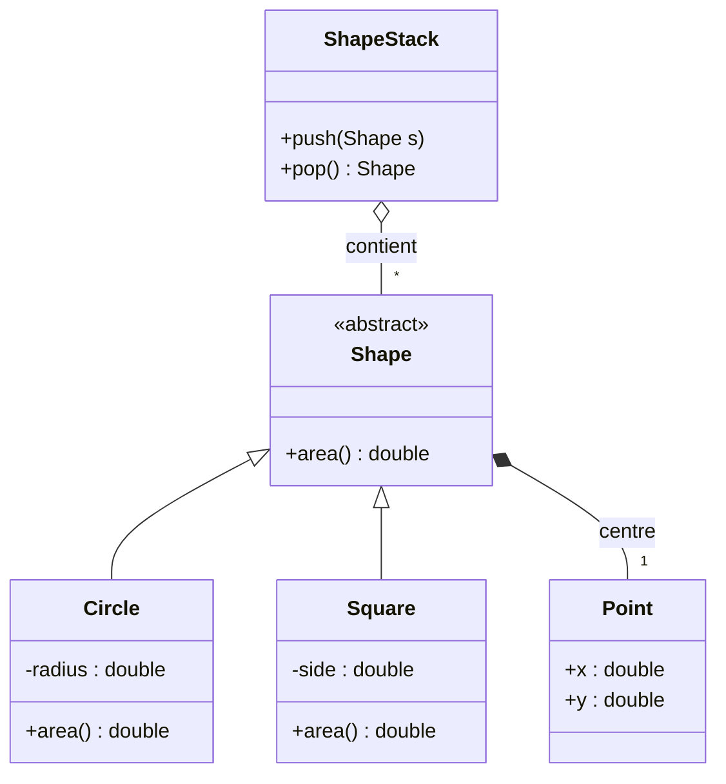

# Diagramme de classes avec Mermaid

```mermaid
classDiagram
    class Shape {
        <<abstract>>
        +area() double
    }
    class Circle {
        -radius : double
        +area() double
    }
    class Square {
        -side : double
        +area() double
    }
    class Point {
        +x : double
        +y : double
    }
    class ShapeStack {
        +push(Shape s)
        +pop() Shape
    }

    Shape <|-- Circle
    Shape <|-- Square
    Shape *-- "1" Point : centre
    ShapeStack o-- "*" Shape : contient
```
